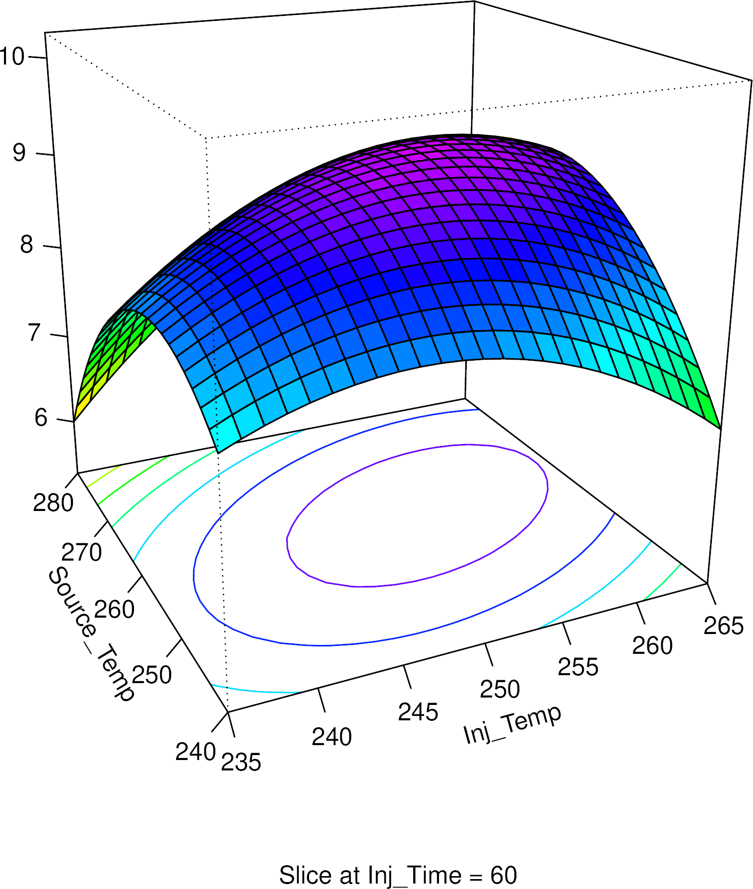
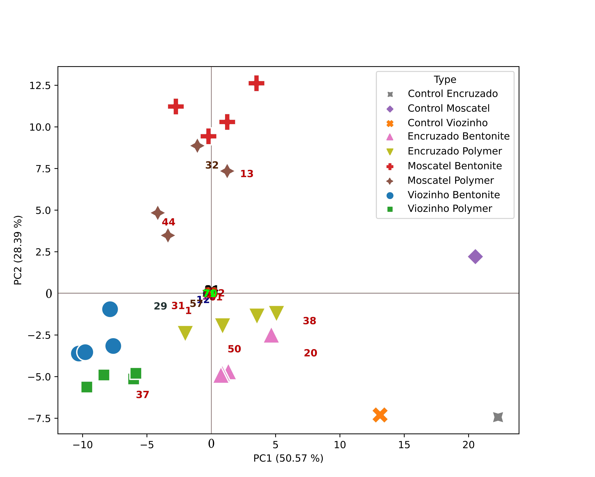
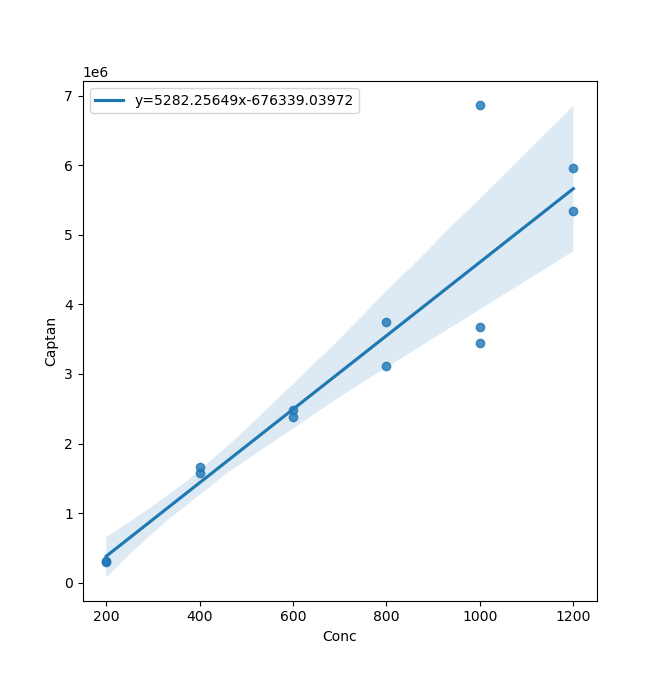

<p align="center">
  
</p>

Python Scripts for Chromatographic Data Processing

# Table of Contents
1. [READ THIS FIRST](#newcomers)
2. [Overview of Functionality](#overview)
	1. [Design of Experiments](#overview_doe)
	2. [Multivariate Analysis](#overview_multivariate)
	3. [Quantification Assistant](#overview_quantification)
	4. [Chromatography Calculators](#overview_calculators)
3. [Package Structure](#structure)
4. [Manual](#manual)
	1. [Design of Experiments](#doe)
	2. [Multivariate Analysis](#multivariate)
	3. [Quantification Assistant](#quantification)
	4. [Chromatography Calculators](#calculators)


# Newcomers, read this! <a name="newcomers"></a>

Thank you for your interest. This package can help you in the treatment of chromatographic data and the like. It does NOT read or manipulate chromatograms directly (the program that came with your instrument can do it better anyways, and there is always OpenChrom). You must integrate your chromatograms, and add that data (in the form of .csv or .xlsx) to this program.

At heart, this is simply an attempt to make a free software package for chromatography calculations. The whole thing is just an easier way to interact with already written libraries, so that you can seamlesly input your data and get a chewed-out result. However, it is obviously your responsibility to know what you are getting and how to interpret it (I mostly don't, but you can do better than me).

If you are familiar with the Python programming language, the module will be very easy to use, and you can change it to your liking, just as long as you abide by the GNU General Public License v3. If you are just using the software, then you can do whatever you want (really) so long as you clearly mention you used it in your publications (this is more for the sake of replicability than my own ego, I promise...). However, if you are changing the software or oherwise publishing it, you must abide by the license, whose most important feature is that it requires all derivatives to release the source code.

If you are not familiar with any of this, and are wondering what the heck is this website GitHub and why do I care, then you can also benefit from this package. There are several scripts that can help you (for the command line).

All the documentation is in this page. Specific tinkering will require you to look into the code... and change it! It's not a bomb, you know? Worst that can happen is it stops working, and if that causes you to get up from the computer and go look at some trees, fine by me!

In section **Overview of Functionality** you can find a simple description of the things this software can do. **Package Structure** describes, well, the package structure, __i. e.__ in what files and directories is what. The remaining sections descibe each sub-module in greater detail.

**A Disclamer:** This is a very small project written by an amateur who doesn't even like computers that much. I've tried my best to make sure that when the software does work, it will give you correct results. However, if something does not work, you can just look into the code. It really is relatively simple.

***

# Overview of Functionality <a name="overview"></a>

This section presents a simple description of Chromapy: its structure and functionality. The program is divided into four submodules:
- **Design of Experiments**
- **Multivariate Analysis**
- **Quantification Assistant**
- **Chromatography Calculators**

## Design of Experiments <a name="overview_doe"></a>



This submodule will assist in the use of experimental designs from beginning to end. It can:
- Generate several experimental design matrixes: full factorial, Plackett-Burman and Box-Behnken (used for response surface modelling);
- Calculate main effect for the screening designs (two level full factorial and Plackett-Burman);
- Perform response surface moddeling for a Box-Behnken design;

This is by far the most complex submodule, but using it is easy enough. However, one must know the basic theory of experimental design in order to avoid mistakes (something I'm very prone to). In the future I might implement the calculation of statistical significance for main effects in screening designs.


## Multivariate Analysis <a name="overview_multivariate"></a>



This submodule can apply some types of multivariate analysis methods mostly for dimensionality reduction. At the moment it does principal component analysis (PCA) and partial least squares (PLS). It can:
- Normalize data according to several different algorithms;
- Calculat principal components for PCA and PLS;
- Plot the results in several different ways (loadings, samples, biplot...)

## Quantification Assistant <a name="overview_quantification"></a>



Automatic quantification from signal values (does not perform integration). Provides also Recovery calculation and some method performance parameters such as detection limits (calculated from the calibration curve, which might not be the ideal method. See below).

## Chromatography Calculators <a name="overview_calculators"></a>

This is a tiny tiny piece of code. It can calculate the volume of solvent used by an HPLC based on the eluent program, which may be usefulf, for example in order to calculate green analytical chemistry metrics for several methods. It can also transform GC mobile phase linear velocity into flow and vice versa for open tubular columns. This is very basic stuff, but someone might find it useful.

***

# Package Structure <a name="structure"></a>

### There are two sides to this package: A module and a collection of scripts.

The module is useful for those familiar with the python programming language, as it can be used in the creation of custom scripts and routines. The code can be found in the folder `chromapy`.

The Scripts are intended for easy command line use, without requiring any specialized computer knowledge. I've put then in the parent folder so that people can just download the whole repository and run them without difficulty. Currently there are these scripts: `chromacalc.py`  `DOE.py`  `PCA.py`  `PLS.py` and `Quantification.py`. The `.py` means these are python source code files, which your python interperter can read.

The scripts are actually just a way to interface with the module (in the `chromapy` folder) through the command line.

There is also an `Examples_Templates` folder which has example input and output files for every function the software performs. Please look into these carefully, because the program requires very specific inputs to work prperly. This is explained in the detailed sections for each submodule.

The file called `Calls_functioning` has several examples of command line calls which will give you a result. Use them as examples to find out how the program works.

There is also a `Windows` folder with two files, which will help you open an anaconda instance in Microsoft Windows.

***

# Manual <a name="manual"></a>

Each submodule is treated separately, and functions (mostly) independently. For fine-grained control or more comments/instructions check the source code. Also, the examples and templates are your friends, use them.

## Multivariate Analysis <a name="multivariate"></a>

Options and explanations are given within each function in the source code. This is a quick exposition of the functionality. You can use the pre-made script for an easier time, especially if you don't understand python.

First, the file should be imported:

```python
import chromapy

df = chromapy.pca_import("Examples/input_data/wine_data.csv")
```

You do NOT need to use .csv files for most functions, but it is advised. Aso supported are: .xls, .xlsx, .xlsm, .xlsb, .odf, .ods, .odt, .csv

The input file should have:


| Sample | Type | Var1 | Var2 | Var3 | ... |
| ------ | ---- | ---- | ---- | ---- | --- |
| water1 | S    | 12.5 | 22.1 | 0.01 | ... |
| water2 | G    | 11.7 | 35.2 | 0.03 | ... |


`Var1`, `Var2`, etc. take any name or number you want, and this will be the name given to the loadings in the biplot. The `Type` is optional, and will separate the samples by color and shape, as well as print a label.

For ease of use and avoidance of errors, please use the sample.csv file provided! You can save it as .xlsx if you wish.

Then, we can normalize if we want:

```python
df_normalized = chromapy.normalize(df, normalization='area')
print(df_normalized)
```

The `normalization` option can be set to:
- "normalize" - Applies the normalize function from scikitlearn, documentation [here](https://scikit-learn.org/stable/modules/generated/sklearn.preprocessing.normalize.html)
- "standard" - This is the default, if no option is given. Documentation [here](https://scikit-learn.org/stable/modules/generated/sklearn.preprocessing.StandardScaler.html)
- "minmax" - Applies the MinMaxScaler. Documentation [here](https://scikit-learn.org/stable/modules/generated/sklearn.preprocessing.MinMaxScaler.html)

- "area" - Will make the sum of all values in a sample equal to 100. Equivalent to using relative percentages of a chromatogram, *ie.* assuming the total area is 100%, and the area of each peak is a certain percentage of that.

Normalizations occur on a sample by sample basis, naturally (not variable by variable).

After normalization, you can calculate the principal components. This function will return 3 objects: `pca_result` has the values for each sample witin the principal component space. `loadings_df` is a nicely formatted dataframe with each loading (variable) and its respective contribution to each principal component, and `loadings` is the actual object created by scikit-learn's computations, which is used internally when graphing.

```python
pca_result, loadings_df, loadings = chromapy.pca(df_normalized)
```

Finally we can graph the plot. This function has many options (check the source code), but this is an easy usage case:

```python
plot = chromapy.pca_plot(pca_result, loadings_df, loadings, output="sample_pca_output.svg", loadings_scale=10)
```

On Biplots (both samples and loadings) you will have to scale up or down the loadings to correctly fit the plot axis. This is done with the `loadings_scale` option, as shown. When the graph is shown on screen, you can save directly, so the `output` option is actually unnecessary.

You can (and should) save the graphs as .svg files, which you can then open in inkscape and edit to your heart's content! Or if you use LaTeX, which does not support .svg directly, you can convert them to .pdf in inkscape.


## Design of Experiments <a name="doe"></a>

Built on top of other DOE packages, provides both matrix design as well as data analysis and response surfaces. Supports Placket-Burman and two-level full factorial designs for screening. Also provides Box-Behnken designs for fitting a response surface.

Most of the code to generate the experimental design matrixes was forked from [here](https://github.com/JamesMarshall31/design-of-experiments/). The response surface fitting is written in the R language and called directly from python using the rpy2 library. The reason is because the calculations use the excelent R library called rsm, and there is no comparable library for python. The first time you run the code, it should install the required R dependencies.

#### Instructions

The input is very simple. For **two level designs** (Plackett-burman and full factorial), simply do:


| Variable1       | Variable2       | Variable3       | Variable4       | ... |
| ---             | ---             | ---             | ---             | --- |
| Var1 low value  | Var2 low value  | Var3 low value  | Var4 low value  | ... |
| Var1 high value | Var2 high value | Var3 high value | Var4 high value | ... |


You can name the variables whatever you want (try avoiding special symbols, like $#|\, etc. The values need not be numbers, they can be for example: Yes/No, Glass/Plastic, MgSO4/Na2SO4 or something like that. You also don't need to put the low value on top and the high value on the bottom. Check the sample file to get an idea.

For **Box-Behnken designs**, the input file changes slightly:


| Variable1            | Variable2            | Variable3            | Variable4            | ... |
| ---                  | ---                  | ---                  | ---                  | --- |
| Var1 center value    | Var2 center value    | Var3 center value    | Var4 center value    | ... |
| Var1 deviation value | Var2 deviation value | Var3 deviation value | Var4 deviation value | ... |


So if you put:


| Temperature   |
| --- |
| 250           |
| 50            |


The values for temperature will be 200, 250 and 300.

For calculating the **main effect** you have to input the .csv with the MATRIX (-1 and 1) which you got when you generated the design, and a second .csv with a single column entitled "Results" (capital R):


| Results |
| ---     |
| 3583.3  |
| 3945.1  |
| 2010.4  |
| 9231.8  |
| ...     |


These results must be in the same order as the experiments in the matrix.


## Quantification Assistant <a name="quantification"></a>

## Chromatography Calculators <a name="calculators"></a>
